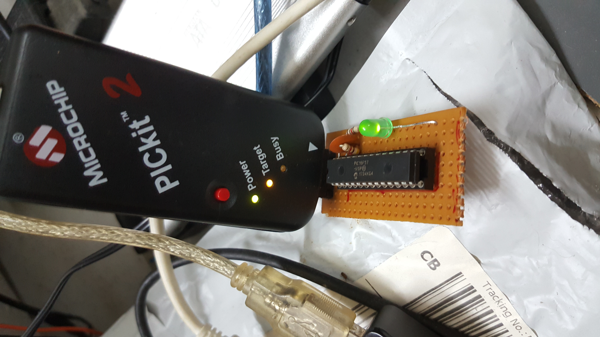

# PIC16F57
Toy program to verify PIC16F57 development system
Toochain is: MPLab 8.33 (on Windows XP on Qemu), Pickit 2, pk2cmd, and handbuilt PIC16F57 target system

Pinout is;

               Pickit2                 pic16f57 sdip
            Pin 1     MCLR/Vpp           28
            Pin 2     Vdd                2
            Pin 3     Gnd                4
            Pin 4     Dat                17 rb7
            Pin 5     Clk                16 rb6
            Pin 6     N/C

PIC16F57 target system needs external RC clock at OSC1(pin 27). R is 4K7 and C is 270pF.
ledblink.asm program needs LED at RB5(pin 15) with series 1K0 resistor.

Typical programming command:

$./pk2cmd -PPIC16F57 -Fledblink.hex -M

PICkit 2 Program Report
12-5-2021, 14:45:05
Device Type: PIC16F57

Program Succeeded.

Operation Succeeded

To run:

$./pk2cmd -PPIC16F57 -GC -T -R

Read successfully.

Configuration Memory

0FFB  

Operation Succeeded
